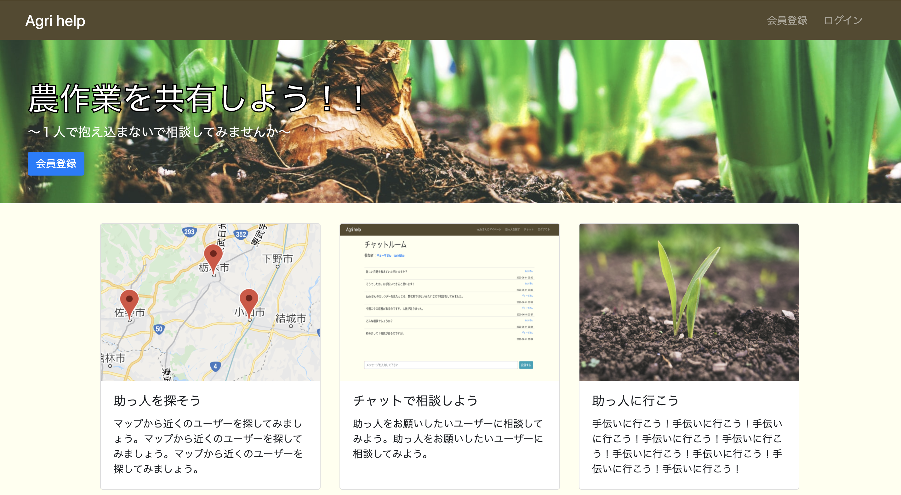
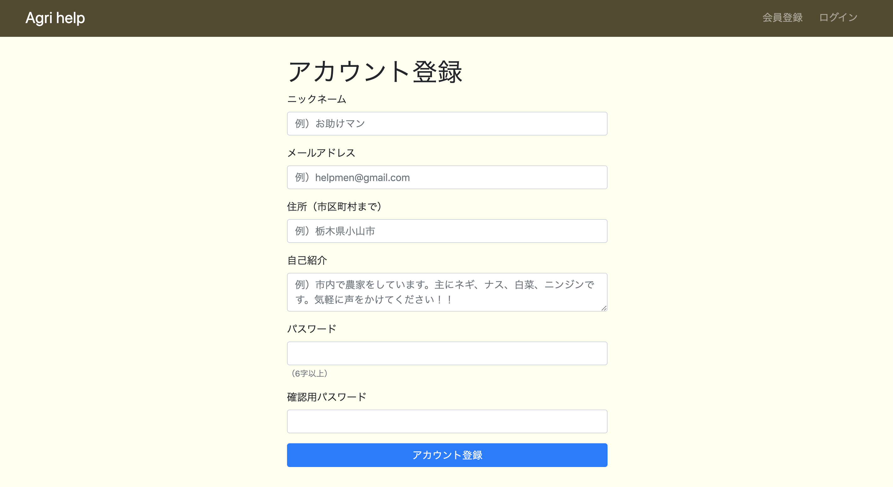
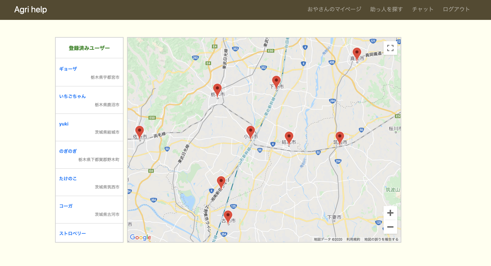
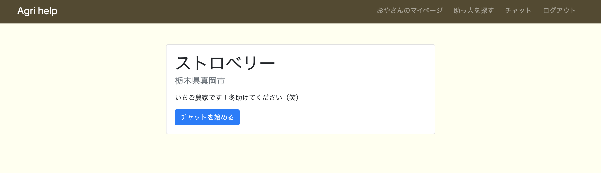
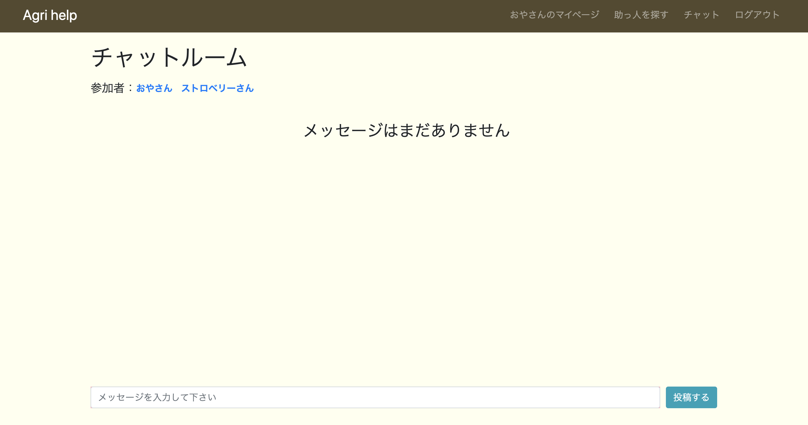
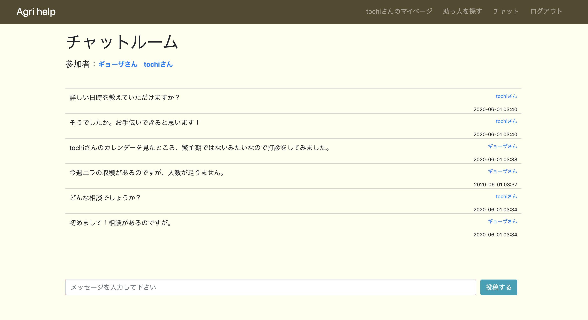

# README

## アプリ名

Agri help  （農業助っ人サイト）

## 概要
 Googleマップから選んだユーザーとチャットを通して、作業の依頼や相談ができるアプリケーションです。

## 制作背景

 農業をしている友人が、繁忙期での人手不足や体調不良時の作業代行について悩んでいること受け、発案したことがきっかけです。
依然としてテクノロジーが行き届いていない環境で働いている人たちの力になりたいと思い作成を開始しました。 
 それに加え、近年ではレンタル農園などと呼ばれるように、趣味で自家菜園を行なっている人も増加しています。
そのような人たちにも本アプリを通して、不在時の対応や初めて行う作業の手伝いなどの際に活用してもらいたいです。

## 使い方

### １.会員登録
 会員登録をします。

### ２.助っ人を探す
 作業を依頼したい人を探すために、Googleマップにて自分の近くにユーザーがいないか確認します。 
 自分の位置がマップの中央になるよう設定しています。

### ３.それぞれのユーザーのマイページにて情報を確認
 Googleマップ上のピンまたは、サイドバーの一覧からユーザーをクリックすると、そのユーザーのマイページに遷移します。
"チャットを始める"ボタンを押下することでチャットが開始されます。

### ４.チャットをする
 見つけたユーザーとの情報交換および依頼内容のすり合わせのためにチャットを行います。

#### 初めてのチャット相手の場合
 新しいチャットルームが作成されます。

#### 過去にチャットをした相手の場合
 すでにチャットルームは作成されているので、過去のチャット内容が反映されています。

## 工夫したポイント

 ユーザー検索にGoogleマップを導入したことです。
実際に作業を手伝ってもらうことが最終目的なので、近くのユーザーを見つけないといけません。
そこで、GoogleMapsAPIを用いてユーザー登録時の住所から緯度・経度を取得し、
自分の近くで登録しているユーザーを見つけ、チャットをすることができます。

## 今後の実装

 ①チャットの利便性向上のために、過去にチャットしたユーザー一覧を作成したいです。 
 ②ユーザーの繁忙期や専門分野がわかるように、カレンダーに栽培中の作物や休耕期などを書き込めるような機能を実装したいです。
（現状は"自己紹介文"という形で文章による表現になっています。）

## 開発環境

- Ruby
  - 2.5.1
- Rails
  - 5.2.4.2
- Javascript
- HTML
- SCSS
- Git
  - 2.26.0
- MySQL
- AWS

# DB 設計

## users Table

| Column       | Type   | Options                   |
| ------------ | ------ | ------------------------- |
| username     | string | null: false               |
| email        | string | null: false, unique: true |
| address      | string | null: false               |
| userimage    | string |                           |
| latitude     | float  |                           |
| longitude    | float  |                           |
| introduction | text   |                           |
| password     | string | null: false               |

### Association

- has_many :messages
- has_many :entries

## rooms Table

| Column | Type | Options |
| ------ | ---- | ------- |
|        |      |         |

### Association

- has_many :messages
- has_many :entries

## entries Table

| Column  | Type    | Options           |
| ------- | ------- | ----------------- |
| user_id | integer | foreign_key: true |
| room_id | integer | foreign_key: true |

### Association

- belongs_to :user
- belongs_to :room

## messages Table

| Column  | Type    | Options           |
| ------- | ------- | ----------------- |
| user_id | integer | foreign_key: true |
| content | string  | null: false       |
| image   | string  |                   |

### Association

- belongs_to :user
- belongs_to :room

---
